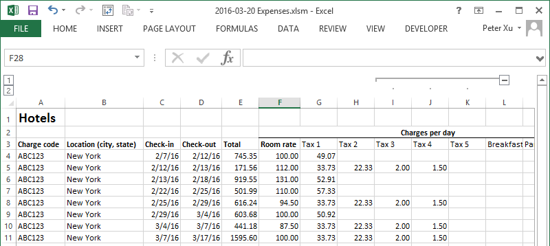

# ExpensesPlus

Originally authored by Peter Xu and maintained by the McKinsey community.

ExpensesPlus is a tool to submit expenses directly from Excel spreadsheets to
McKinsey's Expense Reporting System (ERS: Infor Extensity). You can simply
record expenses there day-to-day and press a single button to upload dozens
of receipts and expense line items!

Features include:

* Everything is run locally -- your McKinsey username and password never get trasmitted to anyone other than the McKinsey expense system
* Support for 5 most commonly used expense types (Meals 1/2/3, Taxi, Hotel)
* Batch uploading of receipts (upload all files in a folder)
* International currencies and locations support

## Usage

1. [Download the ExpensesPlus.zip](https://github.com/pxpeterxu/expensesplus/raw/master/Use%20this/ExpensesPlus.zip) in the `Use this` folder of the repository
2. Extract it to a folder
3. Open the "ExpensesPlus.xlsm" file, and enable macros when prompted
4. Enter your expense details on each of the tabs
5. Press the "Create expense report" button and follow the instructions there
    * Note: you may get an error message from Symantec since the file is rarely found. Press "Allow this file" when you see it

## Developing

1. Clone this repository from GitHub
2. Install dependencies:
    * **[Python 2.7](https://www.python.org/downloads/)**: download the **Windows x86-64 MSI installer**
    * **xlwings v0.3.6** (by running `pip install xlwings==0.3.6`)
    * **requests v2** (by running `pip install requests`)
    * **[pywin32](https://sourceforge.net/projects/pywin32/files/pywin32/)**: make sure to get the latest version for Python 2.7, 64-bit (it should have **win-amd64-py2.7.exe** at the end)
  	* **[py2exe](https://sourceforge.net/projects/py2exe/files/py2exe/0.6.9/)**
3. Make sure everything is working by running `python test.py` and seeing if it exits without any error messages
4. Open the Expenses.xlsm, click `Developer -> Visual Basic` [(see how to enable the Developer tab if you don't see it)](https://www.techonthenet.com/excel/questions/developer_tab2013.php)
5. Change the first line of the `ExpensesPlus` module and change `DEBUGGING = False` to `DEBUGGING = true`
6. Make changes, and then run `python test.py` to make sure it still works after the changes!
